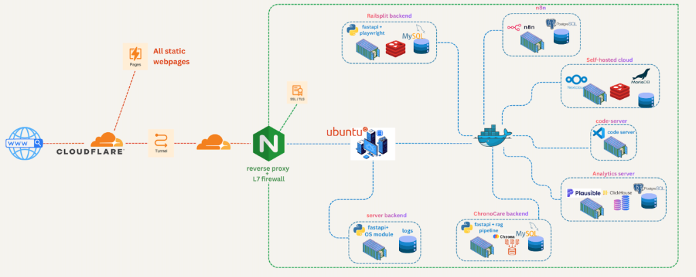
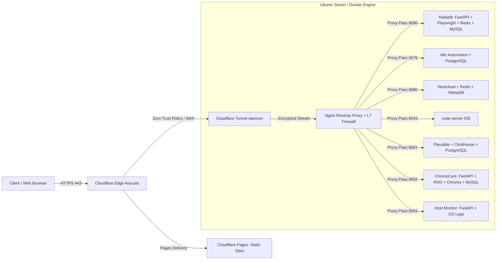

When self-hosting critical developer tooling—such as Nextcloud for storage, n8n for workflow automation, or code-server for remote dev sessions—the classic approach was port forwarding. You would open ports 80 and 443 on your residential router, set up Dynamic DNS (DDNS) via a cron job, and configure Let's Encrypt certificates.

However, exposing residential IP addresses directly invites automated bot scans, brute-force SSH attacks, and potential DDoS vectors. Furthermore, Carrier-Grade NAT (CGNAT) deployed by modern fiber and 5G ISPs often makes direct ingress impossible without a public static IPv4 lease.

In this deep dive, we walk through an architecture that achieves **zero inbound open ports** by combining **Cloudflare Tunnel (`cloudflared`)** with an internal **Nginx reverse proxy** and an **Ubuntu Docker host**. This setup isolates services on distinct Docker bridge networks while applying Cloudflare Zero Trust authentication to sensitive management endpoints.



*Figure: Complete production homelab topology showing Cloudflare edge routing, Cloudflare Tunnel ingress, Nginx L7 reverse proxy, and containerized workloads running on Ubuntu Docker. Source: [www.luckylinux.dev](https://luckylinux.dev).*

## Complete Homelab Service Topology

All external traffic originating from the World Wide Web (`WWW`) first terminates at the Cloudflare Edge network:
1. **Static Webpages**: Delivered globally at low latency via **Cloudflare Pages**.
2. **Dynamic & API Ingress**: Securely tunneled through an outbound **Cloudflare Tunnel** (`cloudflared`) to our local hardware, completely bypassing residential CGNAT and firewall pinholes.
3. **Nginx Reverse Proxy & L7 Firewall**: Terminates internal SSL/TLS, enforces rate-limiting zones, inspects headers, and fans out requests to local Docker bridge networks.

Our **Ubuntu server** hosts a suite of containerized production and development workloads:
- **Railsplit Backend**: FastAPI high-concurrency API powering headless browser automation via Playwright, backed by Redis job queues and MySQL storage.
- **n8n Automation Engine**: Self-hosted low-code workflow automation connected to PostgreSQL for persistent event triggering and cron pipelines.
- **Self-Hosted Cloud (Nextcloud)**: Private file sync and cloud storage with Redis transactional memory locking and MariaDB relational persistence.
- **code-server**: Web-accessible VS Code IDE enabling full remote development with edge MFA authentication.
- **Analytics Server (Plausible)**: Lightweight, privacy-respecting website analytics powered by ClickHouse high-throughput column store and PostgreSQL.
- **ChronoCare Backend**: FastAPI AI service with a Retrieval-Augmented Generation (RAG) pipeline utilizing Chroma vector database and MySQL.
- **Server Monitoring Backend**: FastAPI service interfacing with the Linux OS module for hardware metrics, temperatures, and structured application logs.

## High-Level Request Flow

Instead of listening for inbound SYN packets on the public WAN, the lightweight `cloudflared` daemon maintains outbound HTTP/2 and QUIC connections to the nearest Cloudflare Anycast edge PoPs. Inbound client traffic is routed through Cloudflare, through the tunnel, and into our local Nginx reverse proxy.



Because all traffic enters via an outbound-only connection, your router firewall drops 100% of unsolicited external requests at the WAN boundary.

> [!NOTE]
> Cloudflare Tunnel supports automatic Anycast failover across multiple edge locations. If your primary local ISP connection degrades, `cloudflared` automatically reconnects through alternate edge PoPs without DNS propagation delays.

## Setting Up Cloudflare Tunnel

First, authenticate and register your tunnel using the Cloudflare CLI:

```bash title="tunnel-setup.sh"
# Authenticate against your Cloudflare account
cloudflared tunnel login

# Create the named tunnel
cloudflared tunnel create homelab-production

# Route DNS for your target hostname
cloudflared tunnel route dns homelab-production services.luckylinux.dev
```

This creates a credentials JSON file in `/etc/cloudflared/` containing an elliptical curve private key (`tunnel-id.json`).

### Tunnel Configuration (`config.yml`)

Instead of mapping each individual internal container inside `cloudflared`, we direct all traffic for our subdomain to an internal Nginx proxy instance. This separates tunnel transport from application-layer header rewrites and SSL termination:

```yaml title="/etc/cloudflared/config.yml"
tunnel: 8f23b102-45e2-48f8-b3d9-a9a3b984fa21
credentials-file: /etc/cloudflared/8f23b102-45e2-48f8-b3d9-a9a3b984fa21.json

ingress:
  # Wildcard or specific host routed directly to internal Nginx
  - hostname: "*.services.luckylinux.dev"
    service: https://localhost:8443
    originRequest:
      originServerName: services.luckylinux.dev
      noTLSVerify: false
      caPool: /etc/ssl/certs/local-ca.pem
  # Fallback catch-all must return 404
  - service: http_status:404
```

> [!WARNING]
> Setting `noTLSVerify: true` is common in tutorials but defeats internal network encryption. We generate a local internal CA using `mkcert` or `step-ca` so the hop between `cloudflared` and Nginx remains encrypted with valid certificate chains.

## Hardened Nginx Reverse Proxy Configuration

Nginx acts as the gatekeeper. It inspects host headers, terminates internal TLS, enforces request rate limits, and injects strict security headers:

```nginx title="/etc/nginx/conf.d/services.conf"
# Rate limiting zone: 10 requests per second per IP
limit_req_zone $binary_remote_addr zone=api_limit:10m rate=10r/s;

server {
    listen 8443 ssl http2;
    server_name n8n.services.luckylinux.dev;

    ssl_certificate /etc/ssl/certs/services.crt;
    ssl_certificate_key /etc/ssl/private/services.key;
    ssl_protocols TLSv1.2 TLSv1.3;
    ssl_ciphers HIGH:!aNULL:!MD5;

    # Security Headers
    add_header X-Frame-Options "DENY" always;
    add_header X-Content-Type-Options "nosniff" always;
    add_header Referrer-Policy "strict-origin-when-cross-origin" always;
    add_header Content-Security-Policy "default-src 'self'; script-src 'self' 'unsafe-inline';" always;

    # Extract real visitor IP passed by Cloudflare Tunnel
    set_real_ip_from 127.0.0.1;
    real_ip_header CF-Connecting-IP;

    location / {
        limit_req zone=api_limit burst=20 nodelay;

        proxy_pass http://127.0.0.1:5678;
        proxy_set_header Host $host;
        proxy_set_header X-Real-IP $remote_addr;
        proxy_set_header X-Forwarded-For $proxy_add_x_forwarded_for;
        proxy_set_header X-Forwarded-Proto $scheme;

        # WebSocket support for interactive execution logs
        proxy_http_version 1.1;
        proxy_set_header Upgrade $http_upgrade;
        proxy_set_header Connection "upgrade";
        proxy_read_timeout 86400s;
    }
}
```

## Security & Architecture Comparison

| Vector | Traditional Port Forwarding | Cloudflare Tunnel + Nginx |
| :--- | :--- | :--- |
| **Exposed Ports** | Port 80, 443, 22 exposed to WAN | 0 inbound open ports |
| **Residential IP Leaks** | Direct DNS A record to ISP IP | Shielded behind Cloudflare Anycast |
| **CGNAT Traversal** | Requires expensive static IPv4 | Works natively via outbound QUIC |
| **Auth at Edge** | Hits application authentication | Cloudflare Access MFA / Google SSO |
| **DDoS Mitigation** | Limited by router bandwidth | Filtered at Cloudflare Edge network |

## Zero Trust Access Policies

For ultra-sensitive applications like `code-server` or raw database GUIs, you can enforce **Cloudflare Access** policies directly in the Cloudflare Zero Trust dashboard:
1. Require Hardware Key (WebAuthn / YubiKey) or GitHub Organization OAuth.
2. Restrict allowed country codes and ASN networks.
3. Enforce device posture checks (e.g., corporate WARP client enrolled).

With this layered strategy, an attacker cannot even send an HTTP request to your local application daemon without first completing multi-factor authentication at Cloudflare's edge.

## Conclusion

By offloading perimeter security, TLS management, and DDoS mitigation to Cloudflare's edge while routing traffic internally through an outbound tunnel, you can operate enterprise-grade self-hosted infrastructure from a home lab with complete peace of mind.
