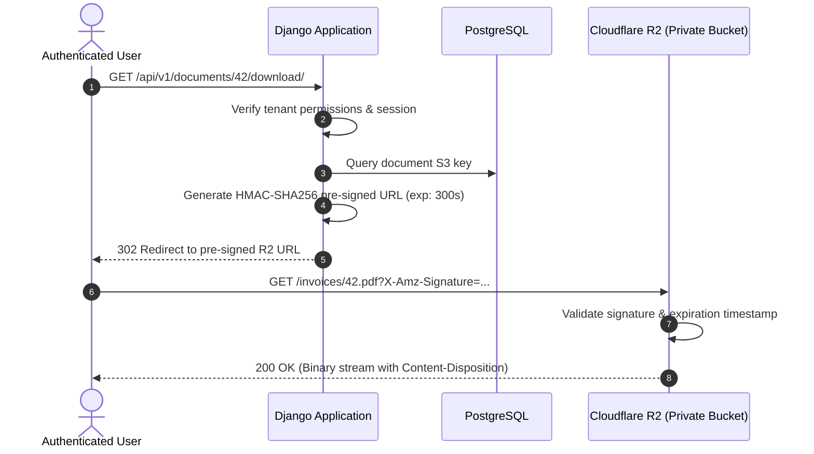

<!-- SAMPLE DRAFT: rewrite in your own words and with your own numbers -->

In multi-tenant SaaS products, user assets fall into two strictly distinct categories:
1. **Public assets**: User avatars, company logos, and public post attachments that can be publicly cached on edge CDNs indefinitely.
2. **Protected assets**: Tax invoices, medical records, ID verifications, and contractual agreements that must never be publicly readable without cryptographic authorization.

Standard AWS S3 setups often solve this with complex bucket policies or proxying downloads through application server memory—which chokes worker threads on large files. Furthermore, AWS charges substantial data egress fees ($0.09/GB).

Cloudflare R2 eliminates egress fees while maintaining S3 API compatibility. In this article, we implement **dual-bucket isolation** in Django using `django-storages` and `boto3`, generating short-lived **pre-signed URLs** that offload high-bandwidth downloads directly to Cloudflare's edge.

## Dual-Bucket Architecture

Rather than toggling object-level ACLs within a single bucket (a notorious source of data leaks), we create two physically separate R2 buckets:



By issuing an HTTP `302 Found` with an expiring pre-signed URL, our Django Gunicorn/Uvicorn workers remain free to handle lightweight database queries rather than streaming multi-megabyte PDF files.

> [!TIP]
> Always set short expiration windows on pre-signed URLs—between 60 and 300 seconds. Because browsers initiate the download immediately upon receiving the 302 redirect, longer expiration times only increase the window for leaked URLs.

## Implementing Custom Storage Backends

We define two distinct storage classes inheriting from `S3Boto3Storage` in `django-storages`:

```python title="core/storages.py"
import os
from storages.backends.s3boto3 import S3Boto3Storage


class PublicMediaStorage(S3Boto3Storage):
    """Storage for publicly accessible assets delivered via custom CDN domain."""
    bucket_name = os.getenv("R2_PUBLIC_BUCKET_NAME", "production-public-assets")
    custom_domain = os.getenv("R2_PUBLIC_CUSTOM_DOMAIN", "cdn.luckylinux.dev")
    default_acl = "public-read"
    querystring_auth = False
    file_overwrite = False
    object_parameters = {
        "CacheControl": "max-age=31536000, public, immutable"
    }


class ProtectedMediaStorage(S3Boto3Storage):
    """Storage for private tenant documents requiring cryptographic signature."""
    bucket_name = os.getenv("R2_PROTECTED_BUCKET_NAME", "production-protected-vault")
    default_acl = "private"
    querystring_auth = True
    querystring_expire = 300  # URL valid for 5 minutes
    file_overwrite = False
    custom_domain = None  # Force generation against R2 endpoint directly
    object_parameters = {
        "CacheControl": "no-store, no-cache, must-revalidate, private"
    }
```

In your `settings.py`, bind these storages cleanly using Django's modern `STORAGES` dictionary setting:

```python title="config/settings.py"
AWS_ACCESS_KEY_ID = os.getenv("R2_ACCESS_KEY_ID")
AWS_SECRET_ACCESS_KEY = os.getenv("R2_SECRET_ACCESS_KEY")
AWS_S3_ENDPOINT_URL = f"https://{os.getenv('CLOUDFLARE_ACCOUNT_ID')}.r2.cloudflarestorage.com"
AWS_S3_REGION_NAME = "auto"
AWS_S3_SIGNATURE_VERSION = "s3v4"

STORAGES = {
    "default": {
        "BACKEND": "core.storages.PublicMediaStorage",
    },
    "protected": {
        "BACKEND": "core.storages.ProtectedMediaStorage",
    },
    "staticfiles": {
        "BACKEND": "django.contrib.staticfiles.storage.StaticFilesStorage",
    },
}
```

## Attaching Storages to Models

In your Django models, specify `storage=storages['protected']` for sensitive uploads:

```python title="documents/models.py"
import uuid
from django.db import models
from django.core.files.storage import storages
from django.contrib.auth import get_user_model

User = get_user_model()


def protected_upload_path(instance, filename):
    ext = filename.split(".")[-1]
    unique_name = f"{uuid.uuid4().hex}.{ext}"
    return f"tenants/{instance.tenant_id}/docs/{unique_name}"


class ConfidentialDocument(models.Model):
    id = models.UUIDField(primary_key=True, default=uuid.uuid4, editable=False)
    tenant_id = models.UUIDField(db_index=True)
    uploaded_by = models.ForeignKey(User, on_delete=models.CASCADE)
    title = models.CharField(max_length=255)
    file = models.FileField(
        storage=lambda: storages["protected"],
        upload_to=protected_upload_path
    )
    created_at = models.DateTimeField(auto_now_add=True)

    def __str__(self):
        return f"{self.title} ({self.tenant_id})"
```

> [!NOTE]
> Using a callable `storage=lambda: storages["protected"]` allows Django migrations to serialize without hardcoding initialized runtime storage instances.

## Generating Download URLs via View

To prevent pre-signed URLs from lingering in browser histories or search logs, we serve a controller endpoint that performs permission validation and returns a redirect:

```python title="documents/views.py"
from django.shortcuts import get_object_or_404, redirect
from django.http import HttpResponseForbidden
from rest_framework.views import APIView
from rest_framework.permissions import IsAuthenticated
from .models import ConfidentialDocument


class SecureDocumentDownloadView(APIView):
    permission_classes = [IsAuthenticated]

    def get(self, request, document_id):
        doc = get_object_or_404(ConfidentialDocument, id=document_id)

        # Enforce tenant isolation
        if str(doc.tenant_id) != str(request.user.tenant_id):
            return HttpResponseForbidden("Access denied to cross-tenant resources.")

        # Optional: override filename in Content-Disposition header
        presigned_url = doc.file.storage.url(
            doc.file.name,
            parameters={
                "ResponseContentDisposition": f'attachment; filename="{doc.title}.pdf"'
            }
        )

        return redirect(presigned_url)
```

## Key Benefits of This Pattern

1. **Zero Bandwidth Bill**: Because Cloudflare R2 does not charge egress bandwidth fees, you can serve gigabytes of user-generated exports without unexpected monthly charges.
2. **Worker Concurrency Protection**: High-latency slow-client downloads are completely handled by Cloudflare's infrastructure rather than exhausting your backend WSGI/ASGI thread pool.
3. **Auditable Audit Trail**: Every download request must authenticate against your backend before the redirect is produced, enabling compliance access logging in PostgreSQL or Redis streams.
